#  Seesun (시선)

멀티캠퍼스 딥러닝 기반 AI 엔지니어링 과정에서 파이널 프로젝트로 진행한 복합 AI 서비스 시선입니다. (우수상 :star: ​) 

Integrative-AI service project from _Deep Learning based AI engineering course_ at Multicampus (won 2nd place :star: ) 

​	

### Table of contents 

1. :scroll: [Overview](#idx1)
2. :game_die: [Role](#idx2)
3. :mag_right: [Skills & Process](#idx3)
4. :open_file_folder: [Service Architecture](#idx4)
5. :outbox_tray: [Main Function](#idx5)
6. :round_pushpin: [Getting Started](#idx6)

---

​	

## 1. Overview 

시선 서비스는 전맹, 약맥 및 시각적으로 불편하신 분들의 새로운 눈이 되어 세상을 밝혀주고자 진행하게 된 복합 AI 서비스입니다.

현재 음성을 통한 "보여줘" , "읽어줘" 와 같은 기능을 지원하며 웹 어플리케이션 형태로 구현하였습니다.

​	

---

​	

## 2. Role 

 [jw0831](https://github.com/jw0831) (팀장)

- Tried application development using Flutter
- Prior research review (OCR, STR, PixelLInk, CRAFT)
- Text detection modeling ( pytesseract)
- Text recognition modeling ( pytesseract)
- Text-image preprocessing (OpenCV , deskew)
- Support modularization
- Translator modeling (Seq2Seq , in progress)

 [ineed-coffee](https://github.com/ineed-coffee)

- Image data collection (AI HUB , Roboflow.ai , Google open image dataset)
- Define custom category & Image annotation work 
- Custom object detection modeling (YOLOv3 , darknet)
- Modularization & Maintenance
- Speech-to-text module work (Kakao open API)
- Support web application implementation (Flask)

 [heewonp](https://github.com/heewonp) 

- Image data collection (AI HUB , Roboflow.ai , Google open image dataset)
- Define custom category & Image annotation work 
- Custom object detection modeling (YOLOv3 , darknet)
- Web application implementation (Flask)

 [cjlee0217](https://github.com/cjlee0217)

- Prior research review (OCR, STR, EAST, CRAFT)
- Text detection modeling ( pytesseract)
- Text recognition modeling ( pytesseract)
- Text-image preprocessing (OpenCV , deskew)
- Translator modeling (Seq2Seq , in progress)

 [chloecmin](https://github.com/chloecmin)

- Text detection modeling ( pytesseract)
- Text recognition modeling ( pytesseract)
- Text-to-speech module work (Clova open API)
- Video-stream module work (Flask)
- Module QA

 	

---

​	

## 3. Skills & Process 

### Project skills 

__1. Language & Tool__ 

- Python 3.8 
- Visual Studio Code
- PyCharm

__2. Object detection model__ 

- Darknet framework :link: [Link](https://github.com/AlexeyAB/darknet)
- Fine tuning from YoloV3 pretrained weights
- opencv-dnn framework (4.4.0)

__3. Text recognition model__ 

- pytesseract (0.3.6)
- deskew (0.10.3)
- opencv-python (4.4.0)

### Development process 

2020.11.24 ~ 2020.12.23 

[WBS in details](https://drive.google.com/file/d/1L0GKjlu0fwBe_UINzBbXqwEl1mUZBACm/view?usp=sharing) 

​	

---

​	

## 4. Service Architecture 

	
	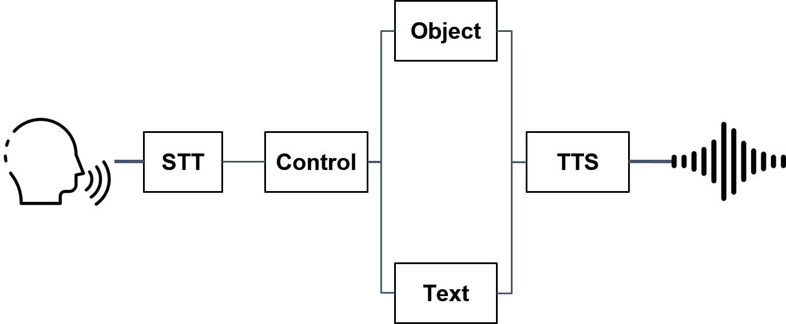 

​	

---

​	

## 5. Main Function 

### 3가지 기능

- 문자 인식
- 사물 인식
- 음성인식 (API)

## 6. Getting Started 

용량이 큰 관계로 다운을 받아 보셔야 합니다.

마지막 슬라이드에 시연 영상이 포함되어 있습니다

발표자료 클릭!

### 프로젝트 배경

기술은 우리를 좀 더 편한 세상으로 인도합니다. 

저희 A-eye팀은 시선 프로젝트를 통해 인공지능을 활용하여 기술에서 소외되신 분들께 도움을 드리고 싶었습니다.

저는 문자인식을 담당하였습니다.

### 문자 인식

	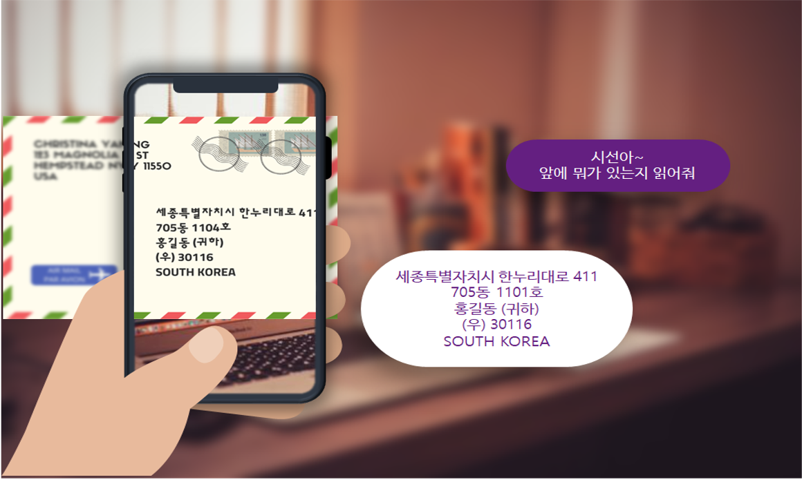

텍스트 인식 기능은 시각이 불편하신 분들이 눈앞의 문자를 인지하는 데에 도움을 드리기 위해 구현되었습니다. 

- 텍스트 인식은 광학 문자 인식(OCR), 장면 문자 인식(STR) 이렇게 2가지 분야로 나눌 수 있습니다. 

우선 OCR은 사람이 쓰거나 기계로 인쇄한 문자의 영상을 이미지 스캐너로 획득하여 기계가 읽을 수 있는 문자로 변환하는 것을 의미합니다. 깨끗한 문서에서 가장 성공적인 성능을 보여줍니다.

반면에 STR은 현실 세계에서 발생하는 다양한 형태의 텍스트 - 예를 들면 간판, 물건에 쓰인 글자 - 를 인식하는 것을 의미합니다.

OCR, STR 모두 문자탐지와 문자 인식으로 구성되어 있는데요, 공통으로 크게 3가지 어려움이 있습니다.

**첫 번째**로, 글자체에 따라 글자를 다르게 인식할 수 있다는 문제가 있습니다. 따라서 다양한 종류의 글자 폰트, 손글씨 데이터는 텍스트 인식의 성능을 높이는 데에 중요한 역할을 합니다. 

**두 번째**는 배경이 복잡한 경우 배경과 문자의 구분이 힘듭니다. 또한, 왜곡, 글자 사이 밀도, 해상도 등에 따라 텍스트 인식 성능에 큰 영향을 받습니다.

**세 번째**로 한글 인식은 영문 인식보다 어렵습니다. 그 이유는 한글이 영문보다 분류해야 할 글자 수가 차이가 크게 나기 때문입니다. 논문에 의하면 글자 수가 실험기준으로 35배 정도 차이가 나서 한글 인식의 경우 정확도를 높이기가 어렵습니다. 

	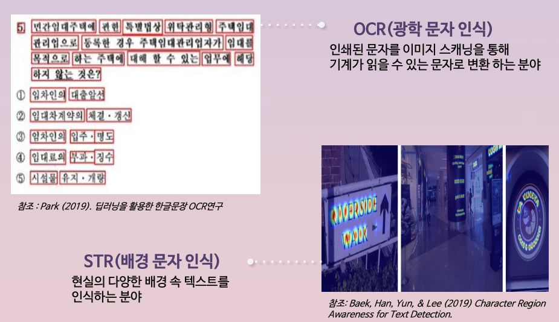

저희 프로젝트에서 텍스트 인식은 일상 생활의 텍스트를 인식해서 알려주는 것을 목적으로 하기 때문에 문서 인식인 OCR보다 STR이 더 적합하다고 판단했습니다.

따라서 STR 분야에서 이미지내의 문자를 잘 탐지하는 모델들을 탐색해보았습니다. 논문 조사 결과 2가지 방법을 시도해봤는데요, East Detector와 CRAFT입니다.

EAST detector는 openCV 기반의 모델로서 STR 분야에서 꽤 좋은 text detection 성능을 가졌다고 알려져있습니다.

다른 방법은 네이버 clova ai에서 개발한 craft 모델입니다. 각 문자 영역과 문자 간의 선호도를 탐색하여 텍스트 영역을 효과적으로 감지 하는 것으로 알려져있습니다.

### EAST 탐지기

EAST 탐지기를 사용하여 문자 인식 까지 수행한 결과입니다.

	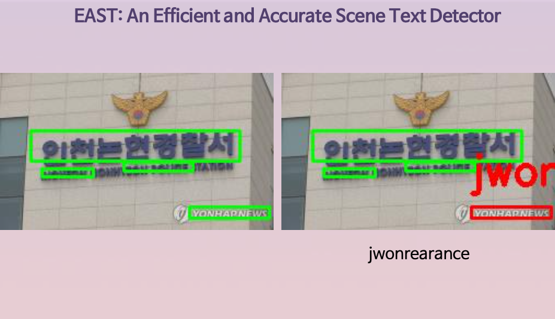

왼쪽 이미지를 보시면, 간판과 이미지에 삽입된 문자에 경계 상자로 표시되어 있습니다. 이를 통해 east detector가 실생활 이미지에서 글자를 어느 정도 탐지하는 것을 알 수 있습니다.

그러나 이렇게 탐지된 글자를 인식한 결과는 좋지 않았습니다. 오른쪽 이미지에서 보시는 바와 같이 영어로 적힌 연합 뉴스를 "jwonrearance"라는 전혀 다른 글자로 인식했습니다.

### CRAFT 탐지기

네이버에서 개발한 CRAFT 탐지기를 사용하여 문자 탐지를 수행한 결과입니다.

	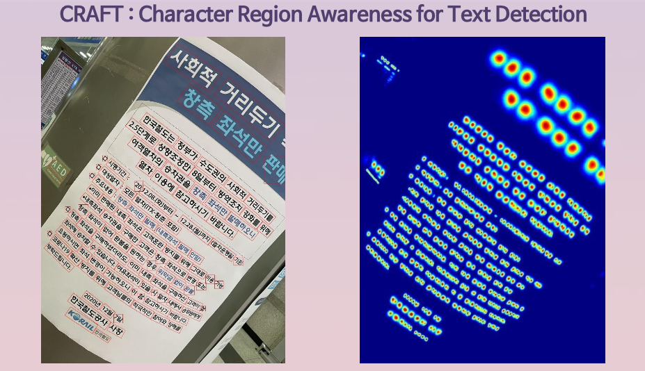

왼쪽 이미지를 보시면 문서가 곡면 기둥에 부착되어 있고, 기울어져 찍혔음에도 불구하고 잘 탐지가 된 것을 확인할 수 있습니다. 텍스트의 기울기에 맞춰서 경계 상자가 함께 기울어져 있는 점이 인상 깊었습니다.

문자 탐지의 성능에서는 높은 정확도를 보이지만, 탐지된 텍스트 영역에서 텍스트를 추출하는 부분이 공개되지 않았습니다. 저희가 직접 문자 인식 기능을 구현하기에는 주어진 프로젝트 기간 내에 불가능할 것으로 예상되었습니다.

따라서 **OCR 방법을 활용한 일상생활 속의 텍스트 인식으로 개발 방향을 수정**했습니다.

Pytesseract는 tesseract라는 오픈 소스 OCR 엔진을 파이썬에서 사용할 수 있게 하는 패키지입니다. 1984~1994년에 HP 연구소에서 개발되었으며, 2006년부터 구글이 개발을 후원하고 있습니다. 테서렉트는 현재까지도 LSTM과 같은 딥러닝 방식을 통해 텍스트 인식률을 지속해서 개선 중입니다. 그리고 한국어를 지원한다는 장점이 있어서 사용하게 되었습니다.

	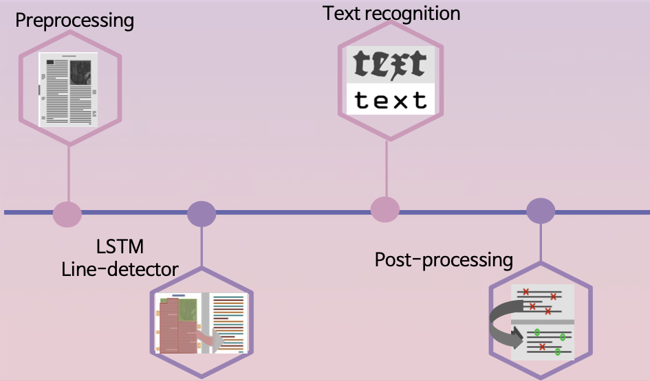

테서렉트가 문서에서 글자를 추출하는 과정에 대해 간단하게 설명하겠습니다. 이미지 데이터가 테서랙트의 구조로 들어가게 되면 기본적인 전처리 과정을 거치게 됩니다. 그리고 LSTM 딥러닝 모델을 통해 글자의 위치를 감지한 후 설정한 언어의 문자 인식모델을 통해 텍스트가 추출됩니다.

### 이미지 전처리

테서렉트를 활용하여 일상생활 속 장면의 문자 인식을 하기 위해서는 이미지 전처리 및 왜곡 보정이 중요합니다. 이 과정에서 OpenCV를 활용했습니다.

테서렉트의 문자 인식 성능 향상을 위해 이미지 필터링과 왜곡 보정 같은 전처리 방법을 적용했습니다. 왜곡 보정 방법 중 저희가 집중적으로 연구한 부분은 image rotation 또는 deskew라고 불리는 부분입니다. OCR의 성능은 똑바른 이미지에서 가장 좋으므로 왜곡된 이미지를 회전시키기 위해 다양한 방법을 시도해봤습니다.

	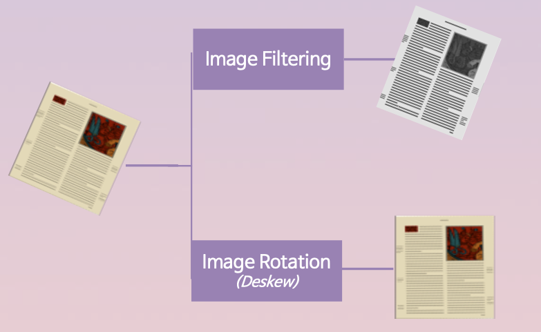

### 왜곡 보정 (Deskew)

광학 문자 인식 방법을 활용한 문자 인식률을 높이기 위해서는 문서의 내용이 가지런히 있어야 할 필요가 있습니다.

회전된 문서를 원래대로 돌리는 왜곡 보정 방법으로 2가지 방법을 테스트해 보았습니다.

	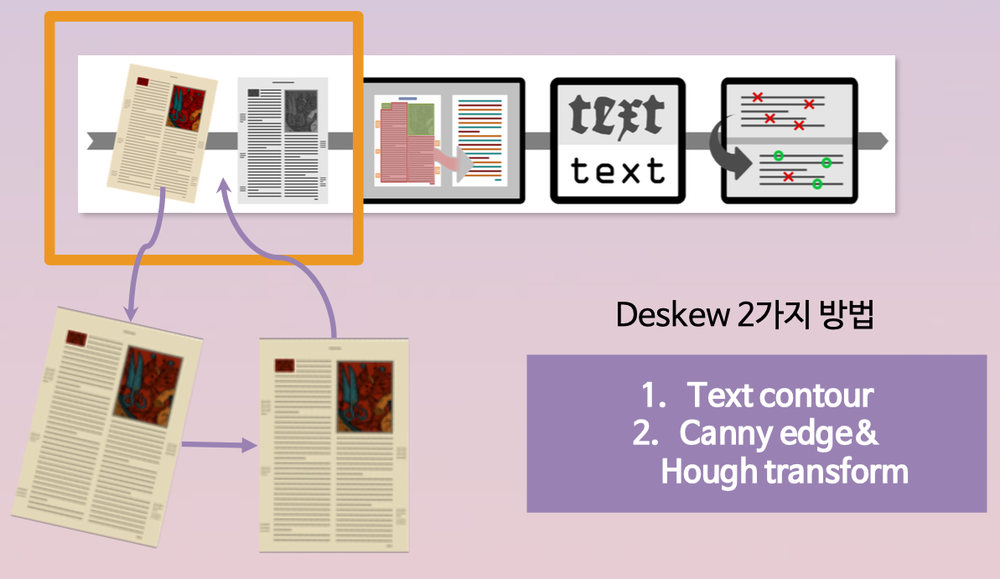

---

- text contour
  - 캡처된 이미지에 흐림, 이진화 및 팽창 전처리를 통해 문단의 윤곽선을 추출하여 왜곡된 각도만큼 회전하는 방법입니다.
- canny edge & hough transform
  - 캡처된 이미지에 캐니 에지 처리 후 허프 변환을 활용하여 문장들을 선으로 감지한 뒤, 각도를 반환받아 왜곡된 각도만큼 회전하는 방법입니다.

	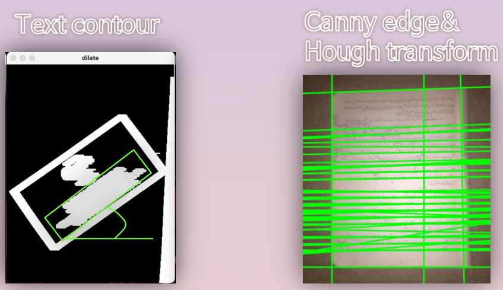

#### 인식 결과 1 (Text Contour 방법)

결과 1 에서는 다음과 같은 텍스트 인식 결과를 보였습니다. 

왼쪽의 커피 쿠폰 이미지에서 “스탬프” , “매장” , “전국” 과 같은 받침을 포함한 몇몇 글자는 잘 인식하지만, 전체적으로 한글을 비슷한 알파벳이나 기호로 인식하는 등의 오류가 있었습니다.

	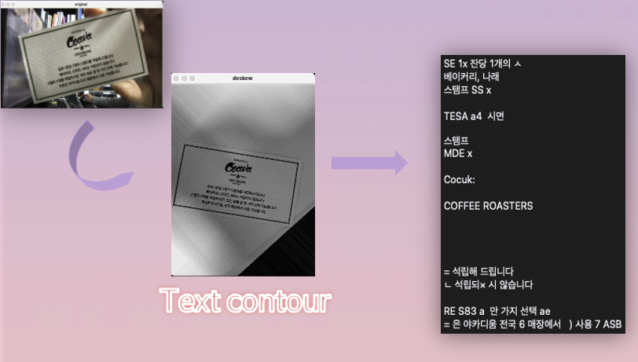

#### 인식 결과 2 (canny edge & hough transform)

결과 2 에서는 다음과 같은 텍스트 인식 결과를 보였습니다.

앞서 확인한 text-contour 방식에서는 인식하지 못했던 “1잔당 1개의”와 같이 숫자와 한글이 뒤섞인 글자들도 잘 구별되어 텍스트로 변환되었습니다.

	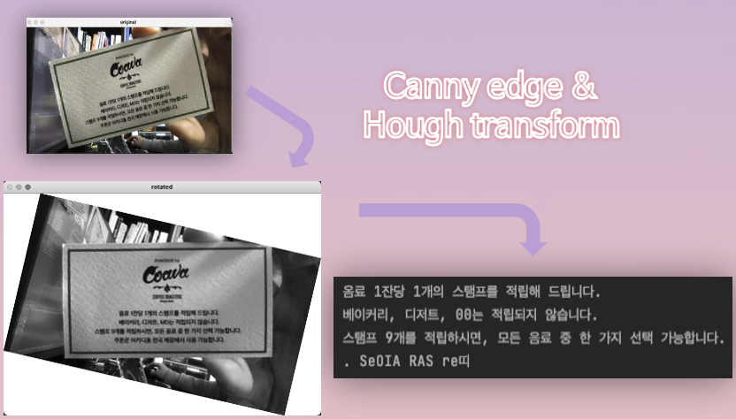

### 문자 인식

Python-tesseract (pytesseract) 문자 인식 라이브러리는 3가지의 문자 인식 함수를 제공합니다.

저희는 인식된 결과를 경계 상자를 통해 확인하기 위해 image_to_data를 활용하였습니다. image_to_box 또한 경계 상자를 제공하나 문자 단위로 인식하기 때문에, 단어 단위로 인식하는 image_to_data를 활용합니다.

	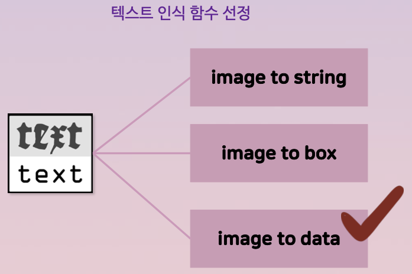

### 인식 결과

	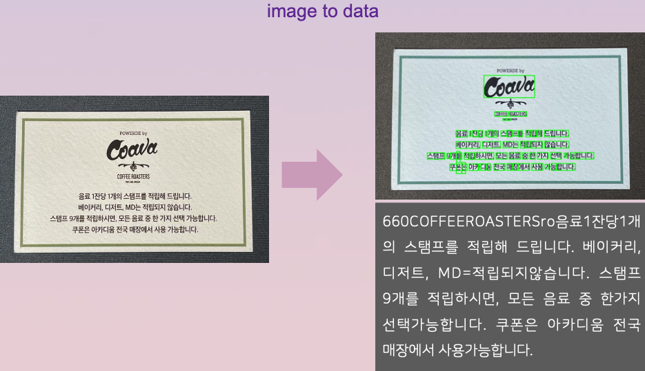

이미지 전처리와 왜곡 수정과정을 거친 뒤 문자를 인식한 결과입니다.

### 서비스 결과

	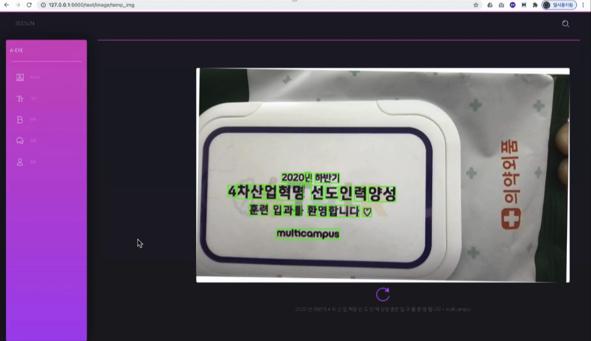

저희가 개발한 Flask 프레임워크를 사용하는 웹 애플리케이션의 문자인식 결과입니다. 음성 API를 통해 인식된 문자를 음성으로 출력합니다.

### 느낀점

짧은 기간임에도 음성인식, 사물 인식, 문자 인식의 복합 AI를 구현했습니다. 

각각의 알고리즘에 대해 데이터를 추가하여 보완하고 최신 알고리즘을 적용하면 취지에 맞게 더 좋은 서비스가 개발될 것으로 보입니다.

팀원의 업무 분배가 잘돼서 협업이 잘 되었습니다.

---

