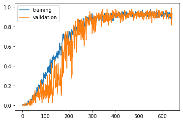

#  니가있는 그곳🏰은 어디야? (이미지 분류 프로젝트)

멀티캠퍼스 딥러닝 기반 AI 엔지니어링 과정에서 세미 프로젝트2 로 진행한 이미지 기반 AI 서비스 입니다. (우수상 ⭐ )

This is an image-based AI service conducted by Semi Project 2 in the multi-campus deep learning-based AI engineering course. (won the prize ⭐)

>  멀티캠퍼스 딥러닝 기반 AI 엔지니어링 세미 2차 프로젝트 (Image)

- Team : 여기요

- Member : **김진원**(팀장), 노용철, 홍세준, 민채정, 안애솔

- Duration : 2020.07.10 ~ 2020.12.23


## 프로젝트 주제 및 내용:

SNS, 블로그, 이미지 검색서비스에서, 마음에 드는 장소를 찾기가 쉽지 않습니다. 이미지 인식 기반 랜드마크 분류 AI 기술을 통한 위치 찾기 서비스를 구현하여, 방문해보고 싶은 장소나 궁금한 장소에대한 위치를 쉽게 찾을 수 있습니다.

## 주제선정 및 배경

기존 서비스는 GPS를 기반으로 위치를 제공하다보니 다소 불편한 점이 있었습니다. 예를 들어, 한강 사진임에도 클라우드에서 다운받은 위치가 인천이여서 인천으로 주소가 뜨는 비슷한 경우가 있었을 것입니다. 그래서 팀 여기요는 CNN알고리즘을 활용하여 위치 정보와 같은 부가적인 요소를 제외하고, 사진 자체만으로 랜드마크의 명칭과 해당 주소를 알려줍니다.

### 결과의 유용성

- 위치 정보가 없는 장소 이미지를 미리 훈련된 랜드마크 기반 분류 알고리즘을 통해 가고 싶은 장소의 이름과 주소를 찾을 수 있으며, 추후 외국인 관광객들이 여행을 더 수월하게 할 수 있게 도움을 줍니다.

- 기존에 사람들이 위치태그를 수동으로 했지만,
 추후에는 이미지 인식기반 위치 제공 서비스를 통해 위치를 더 수월하게 지정할 수 있습니다.

## 활용기술

- Language : 

  - Python

- Libraries : 

  - keras, tensorflow
  - matplotlib

  - pandas, numpy
  - pathlib, shutil, natsort
  - cv2
  - random
  - os

## 프로젝트 역할 분담


### 김진원 (팀장)

- 클릭시 해당 페이지로 이동합니다.

[전처리: 이미지 증식 및 트레이닝 테스트 분리](https://nbviewer.jupyter.org/github/jw0831/Multicampus/blob/main/2.Semi-project_2_Landmark_finder_using_CNN/1.Preprocessing/2.image_file_generation.ipynb)

[전처리: 숨겨진파일 제거](https://nbviewer.jupyter.org/github/jw0831/Multicampus/blob/main/2.Semi-project_2_Landmark_finder_using_CNN/1.Preprocessing/3.removedot.ipynb)

[랜드마크 분류 모델 ResNet-50 훈련](https://nbviewer.jupyter.org/github/jw0831/Multicampus/blob/main/2.Semi-project_2_Landmark_finder_using_CNN/2.CNN_models/Res-Net50withPrediction_camp7.ipynb)

- 조기 종료와 학습률 조정을 통해 모델 훈련

```python
from keras.callbacks import EarlyStopping, ReduceLROnPlateau
# 조기종료: 지정된 기간 동안 모니터링하는 평가지표에서 성능 향상이 일어나지 않은 경우 학습을 중단
earlystop = EarlyStopping(patience=100)

# 모델 학습시 지정된 기간동안 평가지표에서 성능 향상이 잃어나지 않으면 학습률 조정
learning_rate_reduction = ReduceLROnPlateau(monitor='val_accuracy',
                                           patience=30,
                                           verbose=1,
                                           factor=0.5,
                                            min_lr=0.00001)
callbacks=[earlystop, learning_rate_reduction]
```

- 조기종료와 학습률 조정 콜백을 활용 하였으므로 epoch을 10만으로 지정해 보았습니다.

```python
# 모델 학습
history=resnet50.fit_generator(
        train_generator,
        steps_per_epoch=15,
        epochs=100000,
        validation_data=val_generator,
        validation_steps=5,
        callbacks=callbacks
        )
```

- **훈련결과**
  - epochs 644 수행 (최고 accuracy : 0.97083336 -552 Eopoch / 최고 val_accuracy : 0.987500011920929-641epoch)

<p align="center"><a></a></p>

[ResNet50의 활성화 채널 및 필터 시각화](https://nbviewer.jupyter.org/github/jw0831/Multicampus/blob/main/2.Semi-project_2_Landmark_finder_using_CNN/4.Visualization/ResNet50_필터_특성맵_시각화.ipynb)

[히트맵 시각화](https://nbviewer.jupyter.org/github/jw0831/Multicampus/blob/main/2.Semi-project_2_Landmark_finder_using_CNN/4.Visualization/heatmap시각화.ipynb)

[슬라이딩 윈도우를 활용하여 CNN 분류기로 객체 탐지기 만들기](https://nbviewer.jupyter.org/github/jw0831/Multicampus/blob/main/2.Semi-project_2_Landmark_finder_using_CNN/4.Visualization/detect_with_classifier_LandMark.ipynb)

- 마우스 휠을 빨리 작동하시면 바운딩 박스가 이동하는 효과를 누리실 수 있습니다.


슬라이딩 윈도우 

	- 이미지

NMS (Non-Maximum Suppression) 을 통한 중복 바운딩 박스 제거

## 프로젝트 수행방향

<p align="center">발표자료 클릭!</p>

<p align = "center"><a href="https://drive.google.com/file/d/1JeD5fIuqkfmnDnyQf8Z0I6YAEkV6EOkk/view?usp=sharing" title="CNN project"></a></p>


