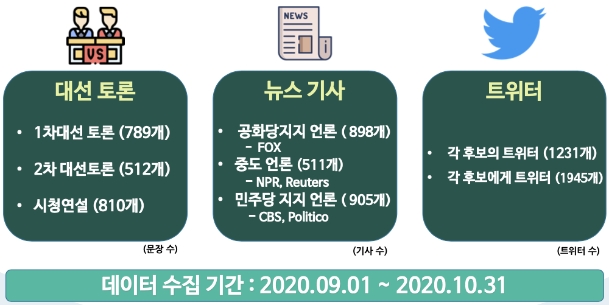

# 📰 텍스트 마이닝 미니 프로젝트 : 미국 대선 관련 뉴스 기사 & 트위터 & 토론 텍스트 마이닝을 통한 감성 분석 및 예측 👍 👎   

멀티캠퍼스 딥러닝 기반 AI 엔지니어링 과정에서 세미 프로젝트1 로 진행한 텍스트 기반 AI 서비스 입니다. (우수상 ⭐ )

This is an text-based AI service conducted by Semi Project 1 in the multi-campus deep learning-based AI engineering course. (won the prize ⭐)	

>  멀티캠퍼스 딥러닝 기반 AI 엔지니어링 세미 1차 프로젝트 (NLP)

- Team : 뽑아조

- Member : **김진원**(팀장), 박지원, 이지윤, 이동재

- Duration : 2020.10.29~2020.11.11
- Topic : 미국 대선 관련 뉴스 기사 & 트위터 텍스트를 활용하여 기초적인 자연처 전처리 과정을 통해 감성 분석 및 대선 예측을 진행

## 활용기술

- Language : 

  - Python

- Libraries : 

  - keras, tensorflow
  - sklearn
  - nltk
  - matplotlib,  folium

  - pandas, numpy
  - json, requests
  - selenium, bs4(BeautifulSoup)
  - time, tqdm, random, datetime
  - re

## 주제 선정 배경

탄핵위기와 북핵 문제 및 코로나 대응 미흡으로 위기에 몰린 트럼프, 그리고 바이든 두 후보자에 대한 관심이 쏠리고 있습니다.

2016년 이후 미국과 우리나라에서는 선거를 예측하는데 빅데이터 활용이 크게 늘고 있습니다.

특히 2016년 트럼프와 클린턴의 대결에서 여론조사가 클린턴의 우세를 이야기하고 있을 때 빅데이터 분석 결과는 트럼프의 승리를 적중하였습니다.

이러한 흐름에 따라 2020년 10월 29일, 뽑아조팀은 좋은 대통령이 당선되길 바라며, 대선과 관련된 텍스트를, 머신러닝과 딥러닝 기술을 활용하여, 2020년 미국의 대통령 선거 결과를 예측하는 프로젝트를 진행 하였습니다.

## 프로젝트 역할 분담

### 김진원 (팀 리더)

- 클릭시 해당 페이지로 이동합니다.

- **사전조사**
  - [자연어처리 공부](https://github.com/jw0831/TIL/tree/master/Natural_Language)
  - [방향성 조사1](https://github.com/jw0831/Multicampus/blob/main/3.Semi-project_1_text_mining_for_US_election_NLP/진행방향/프로젝트의%20방향성.md)
  - [방향성 조사2](https://github.com/jw0831/Multicampus/blob/main/3.Semi-project_1_text_mining_for_US_election_NLP/진행방향/프로젝트%20방향성%202.md)

- **코드작성**

  1. [Twitter 크롤링](https://nbviewer.jupyter.org/github/jw0831/Multicampus/blob/main/3.Semi-project_1_text_mining_for_US_election_NLP/데이터%20수집%20코드/트위터/트위터%20크롤링.ipynb)

  2. [트위터 자연어 처리, 시각화 및 감성분석](https://github.com/jw0831/Multicampus/blob/main/3.Semi-project_1_text_mining_for_US_election_NLP/데이터%20분석%20및%20시각화/Twitter_WordCloud_BarPlot_senti_LSTM.ipynb)
     - 로드 실패시 Reload 한번더 눌러주세요^^

  3. [감성데이터 활용 LSTM 기반 시계열 예측](https://nbviewer.jupyter.org/github/jw0831/Multicampus/blob/main/3.Semi-project_1_text_mining_for_US_election_NLP/데이터%20모델링/LSTM%20모델링%20및%20예측.ipynb)

## 프로젝트 수행방향

발표자료 클릭!

#### 대선과 관련된 텍스트를 분석하여 2020 미국 대통령 선거 결과를 예측

#### 수행 세부 목표

#### 데이터 수집

#### 자연어 처리과정

#### 단어 빈도수를 통한 워드클라우드 생성

**트럼프** 

- 언론에 관련된 단어를 많이 사용

**바이든**

- 함께 만들어가는 미국을 강조

#### 두 후보의 TF-IDF (단어 빈도 - 역 문서 빈도) 분석

문서 내에서 특정단어의 중요도 기반으로 분석, 결과적으로 각 후보가 중요하게 생각하는 단어를 도출

**트럼프**

- Great 을 최고로 많이 강조
- 뉴스 와 거짓이라는 말을 상당히 강조

**바이든**

- 미국인의 오늘 하루를 강조
- 미래를 위한 단어들을 중요하게 생각

#### 각 후보들에 대한 사람들의 워드클라우드 및 TF-IDF

**사람들 -> 트럼프**

- 트럼프 에게는 사랑 이라는 말이 가장 많았습니다. 
  - 비꼬는 식의  ‘나 이사람 정말 좋아 와 같은 사랑’
  - 트럼프가 코로나에 걸렸을때 빨리 완쾌 하라는 의미의 사랑
- 거짓말 이라는 말도 상당히 있는 것을 확인.

**사람들 -> 바이든**

- 얻다, 한해, 사람들, 미국
- 바이든의 명성을 까먹었던 둘째 ‘헌터 바이든’ 에 대한 언급

### 텐서보드의 임베딩 프로젝터를 활용한 Word2Vec 시각화

- Word2Vec 을 활용하여 두 후보의 이름과 관련된 단어들을 도출할 수 있었습니다.

- 두 후보와 연관된 단어들을 시각적으로 확인하기 위해 텐서보드의 임베딩 프로젝터를 활용

- **트럼프**

  - 부정적인 단어가 많이 보임
  -  fallen , desperate , hysterical 같은 직접적인 부정 단어부터 weak , xenophobia 와 같은 간접적인 부정 단어들을 확인

  - 주변 인물에 단어의 등장은 적은 대신 minesota 와 같은 경합 주에 대한 단어 비중이 높은 것을 확인

- **바이든**
  - 트럼프,카말라와 같은 주변 인물 단어 확인 가능
  - sleepy , hide , son 같은 부정적인 단어 확인 가능

### Vader 감성사전을 활용하여 두 후보에 대한 사람들의 감성분석

- 긍정 / 부정이 명확하게 보이는 트위터를 기준으로 9월1일~10월31일 기간의 감성분석을 실시

- 문장 단위로 구성된 코퍼스에서 각 문장에 대해 감성분석을 하였으며, 일별로 그룹화하여 평균적인 감성점수를 시계열로 나타내었습니다.

- 각 문장의 긍정 부정 중립을 기반으로 컴파운드가 계산되었고, 계산된 컴파운드를 기준으로 감성을 구분지을 수 있었습니다. 

### 두 후보에 대한 감성 시각화

- 트럼프에 대한 감정은 긍정 및 부정의 변동이 심한 반면에, 바이든은 대부분 긍정인 것이 확인 되었습니다.

- 긍정적 감정이 가장 많은 10월 4일은, 도널드 트럼프 대통령이 코로나 확진으로 부터 이틀 뒤 입니다. 
  - 이날 많은 사람들에게 응원의 메시지를 받은 것을 확인할 수 있었습니다.

- 10월 20일 트럼프는 펜실베니아주 이리에서 선거 집회를 하였습니다.

- 10월 29일은 트럼프와 바이든 두 후보 모두 플로리다 주 탬파에서 집회를 열었습니다.
  - 트럼프는 이날 저녁에, 노스캐롤라이나주를 찾아 유세를 할 계획이었지만, 몇 시간 전 ‘바람이 너무 많이 분다’는 이유로 취소하였습니다. 부정적 요인이 여기서 나왔을 것이라고 생각합니다.

### 미래 감성지수 예측을 위한 LSTM 딥러닝 알고리즘 적용

- 128개의 셀 유닛을 사용하여, 7번의 타임 스텝과 한개의 피처로 Many to One 방식의 모델을 만들었습니다.

- 각 후보에대한 감정을 기반으로 만들어진 2개의 모델을 사용하여, 선거 당일의 각 후보에 대한 감정을 파악하기 위해, 향후 5일을 더 예측해 보았습니다.

### 예측 결과

- 09월01일~10월31일 사이의 일별 감성 점수를 통해 학습한 LSTM 으로부터 11월 5일 까지의 감성 점수를 예측한 결과 그래프 입니다. 

**트럼프**

- 이슈에 따라 감성 점수의 변화량이 큰 트럼프의 경우 11월에 접어들며 <u>지속적인 하락세를 보일것으로 예측</u>
- 투표 당일의 감성 점수 예측 = 0.02

**바이든**

- 상승과 하락의 폭이 비교적 적은 바이든의 경우 투표 당일인 11월3일 <u>소폭 적인 상승세일 것으로 예측</u>
- 투표 당일의 감성 점수 예측 = 0.37

### 분석 결과

- 다방면으로 분석한 결과 바이든 대통령이 트럼프보다 우수한 성적을 거두었습니다.

- 실제로 바이든 대통령이 당선되었음을 확인해 볼 수 있었습니다.

### 기대효과

- 머신러닝과 딥러닝을 활용하는 예측 방법은, 앞으로도 유용하게 사용될 것으로 보입니다.