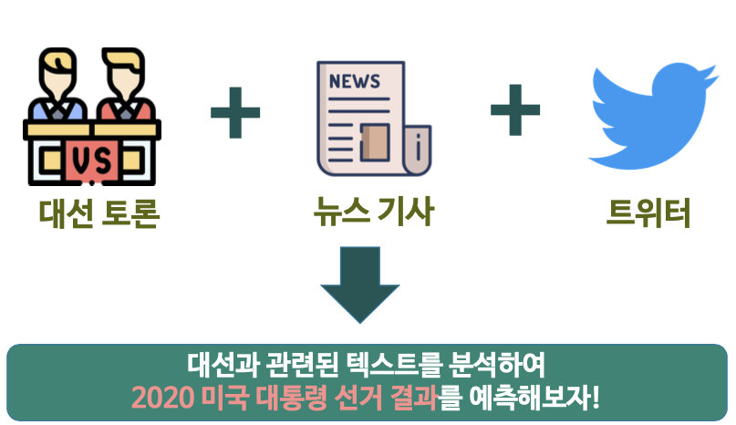

# 📰 텍스트 마이닝 미니 프로젝트 : 미국 대선 관련 뉴스 기사 & 트위터 & 토론 텍스트 마이닝을 통한 감성 분석 및 예측 👍 👎   

멀티캠퍼스 딥러닝 기반 AI 엔지니어링 과정에서 세미 프로젝트1 로 진행한 텍스트 기반 AI 서비스 입니다. (우수상 ⭐ )

This is an text-based AI service conducted by Semi Project 1 in the multi-campus deep learning-based AI engineering course. (won the prize ⭐)	

>  멀티캠퍼스 딥러닝 기반 AI 엔지니어링 세미 1차 프로젝트 (NLP)

- Team : 뽑아조

- Member : **김진원**(팀장), 박지원, 이지윤, 이동재

- Duration : 2020.10.29~2020.11.11
- Topic : 미국 대선 관련 뉴스 기사 & 트위터 텍스트를 활용하여 기초적인 자연처 전처리 과정을 통해 감성 분석 및 대선 예측을 진행

## 활용기술

- Language : 

  - Python

- Libraries : 

  - keras, tensorflow
  - sklearn
  - nltk
  - matplotlib,  folium

  - pandas, numpy
  - json, requests
  - selenium, bs4(BeautifulSoup)
  - time, tqdm, random, datetime
  - re

## 주제 선정 배경

탄핵위기와 북핵 문제 및 코로나 대응 미흡으로 위기에 몰린 트럼프, 그리고 바이든 두 후보자에 대한 관심이 쏠리고 있습니다.

2016년 이후 미국과 우리나라에서는 선거를 예측하는데 빅데이터 활용이 크게 늘고 있습니다.

특히 2016년 트럼프와 클린턴의 대결에서 여론조사가 클린턴의 우세를 이야기하고 있을 때 빅데이터 분석 결과는 트럼프의 승리를 적중하였습니다.

이러한 흐름에 따라 2020년 10월 29일, 뽑아조팀은 좋은 대통령이 당선되길 바라며, 대선과 관련된 텍스트를, 머신러닝과 딥러닝 기술을 활용하여, 2020년 미국의 대통령 선거 결과를 예측하는 프로젝트를 진행 하였습니다.

## 프로젝트 수행방향 및 역할 분담

### 김진원

- 사전조사
  - [자연어처리 공부](https://github.com/jw0831/TIL/tree/master/Natural_Language)
  - [방향성 조사1](https://github.com/jw0831/Multicampus/blob/main/3.Semi-project_1_text_mining_for_US_election_NLP/진행방향/프로젝트의%20방향성.md)
  - [방향성 조사2](https://github.com/jw0831/Multicampus/blob/main/3.Semi-project_1_text_mining_for_US_election_NLP/진행방향/프로젝트%20방향성%202.md)

- 클릭시 해당 코드로 이동합니다.
  1. [감성데이터 활용 LSTM 기반 시계열 예측](https://nbviewer.jupyter.org/github/jw0831/Multicampus/blob/main/3.Semi-project_1_text_mining_for_US_election_NLP/데이터%20모델링/LSTM%20모델링%20및%20예측.ipynb)
  2. [Twitter 크롤링](https://nbviewer.jupyter.org/github/jw0831/Multicampus/blob/main/3.Semi-project_1_text_mining_for_US_election_NLP/데이터%20수집%20코드/트위터/트위터%20크롤링.ipynb)
  3. 

### 수행방향

