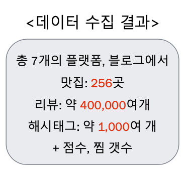

## 멀티캠퍼스 딥러닝 기반 AI엔지니어링 팀 프로젝트

기간: 2020/10/13~2020/10/22

# 호갱노노 in 제주 

> [팀명 : 제주 사다수]
>
> 맛집 분석을 통해 합리적인 상권을 찾아라!

## 활용기술

- Language : 

  - Python

- Libraries : 

  - matplotlib,  folium

  - Pandas, Numpy
  - json, requests
  - selenium, BeautifulSoup
  - time, tqdm, random
  - re

## 주제 선정 배경

*더 이상 광고 글에 속지 말자!*

제주도에 여행 갈 땐 항상 제주도 맛집을 찾아보곤 합니다. 
하지만 SNS, 블로그에는 광고 글이 넘쳐 우리의 순수한 선택을 방해하기 일쑤지요. 
이러한 경험을 바탕으로 제주도 맛집의 감성 분석을 통해 광 고글이 아닌 일명 ‘내 돈 내산’ 리뷰들을 바탕으로 제주도 맛집을 분석했습니다. 

또한 결과를 통해 맛집 주변 상권을 분석 및 시각화를 하여 예비 창업자들에게 자원을 제공하고 합니다.

## 프로젝트 주제 및 내용

- 제주도 맛집을 통한 상권 분석, 예측 맛집 **분석**
- 평점 데이터와 그 가게의 키워드들이 비례하는지 **예측**
- 가게의 리뷰들이 광고인지 리뷰인지 비교하여 평점 재**산출**
- 많이 언급된 가게 근처에 어떤 상권들이 들어서도 나갔는지 **비교**

---

### 프로젝트 수행방향 및 역할 분담

| 이름 | 역할                            |
| ---- | ------------------------------- |
| **김진원** | 네이버, 인스타 크롤링 / **지도시각화 (folium)** / 발표자료 준비 |
|이찬주|카카오 크롤링 / 감성분석 / 발표자료 준비|
|조원우| 망고플레이트, 다이닝코드 크롤링 / 발표자료 준비 및 디자인    |
|박희원|다음, 네이버 API / 감성분석 / 발표자료 준비|

#### 김진원 

- 클릭시 해당 코드로 이동합니다.

  [1. 인스타그램 크롤링](https://nbviewer.jupyter.org/github/jw0831/Multicampus/blob/main/4.호갱노노in제주/김진원/insta_jeju.ipynb)

  [2. Naver 크롤링](https://nbviewer.jupyter.org/github/jw0831/Multicampus/blob/main/4.호갱노노in제주/김진원/naver_crawling.ipynb)

  [3. 지도에 사용하기 위한 상점 데이터 병합](https://nbviewer.jupyter.org/github/jw0831/Multicampus/blob/main/4.호갱노노in제주/김진원/merge%20restaurants.ipynb)

  [4. 감성데이터 병합](https://nbviewer.jupyter.org/github/jw0831/Multicampus/blob/main/4.호갱노노in제주/김진원/merge_emotion_list.ipynb)

  [5. 네이버 리뷰 병합](https://nbviewer.jupyter.org/github/jw0831/Multicampus/blob/main/4.호갱노노in제주/김진원/merge_naver_reviews.ipynb)

  [6. 읍면동 데이터 처리](https://nbviewer.jupyter.org/github/jw0831/Multicampus/blob/main/4.호갱노노in제주/김진원/jeju_EMD_LI_divide.ipynb)

  [7.  제주도 시각화](https://nbviewer.jupyter.org/github/jw0831/Multicampus/blob/main/4.호갱노노in제주/김진원/jeju_folium_jw0831.ipynb)

## 개발 과정 

발표자료 클릭!

제주도의 읍면동 지도를 얻기 위해 SHP형식의 파일을 geojson 파일로 변환하는 작업 진행

# 결과

### 수집 결과

### 형태소 분석 및 감성사전 업데이트

### 제주도 "읍/면/동/리" 분류와 상권시세 등을 시각화

- 맛집 위치 및 툴팁을통한 가게명 표시
- 마커 클러스터 기능을 통한 지역별 상점수 시각화

- 각 상점별 감성점수 데이터 업데이트

- **결과보기**
- 아래 링크에 들어가신 후 우측에 다운로드 버튼으로 html 파일을 받으신 뒤에 크롬 브라우저로 실행시키시면 됩니다. 
  - [다운로드 링크](https://github.com/jw0831/Multicampus/blob/main/4.호갱노노in제주/visual_jeju.html)

> 작성자 (김진원)
>
> 1. 리뷰에대한 감성분석을 통하여서 좀더 유의미한 점수를 도출할수 있었습니다.
> 2. 시각화를 통하여 "읍/면/동/리"의 시세를 한눈에 파악할수 있으며 어느 지역에 맛집이 군집되어 있는지 확인이 가능합니다.
> 3. 대부분의 맛집은 여행 태마와 지형상의 이유로 해안에 위치한것으로 나타났습니다.
> 4. 앞으로 추가적인 분석을 할 경우 상권과 유동인구자료를 조사하여 시각적인 분석 (EDA)를 진행한다면 더 좋은 결과가 나올것이라 예상합니다.

